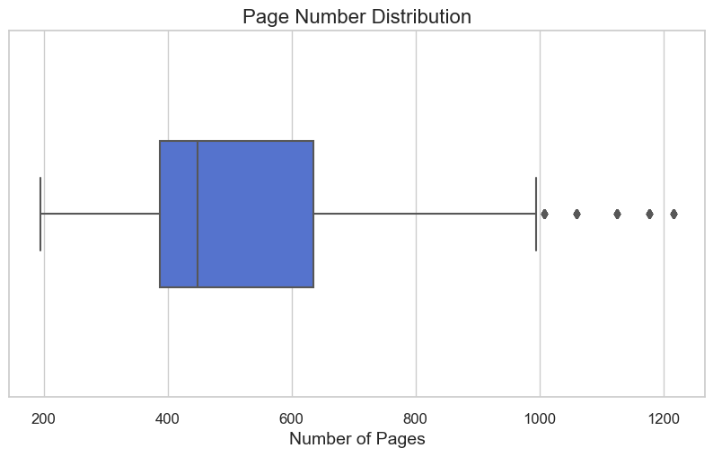
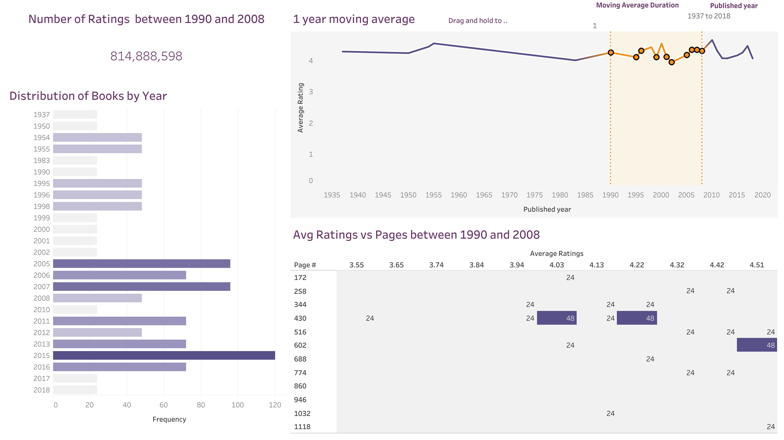

# Fantasy Book Scraping and Analysis

## Project Overview

In this project, I set out to collect and visualize data related to fantasy books from Goodreads. I successfully scraped book information, conducted data analysis, and created visualisations using Tableau to gain valuable insights into the captivating world of fantasy literature. This project showcases my skills in web scraping, data manipulation, and data visualization using Python and relevant libraries.

My interactive dashboard can be found [here](https://public.tableau.com/app/profile/iyud.dissanayake/viz/BookData_16981143060890/Dashboard1?publish=yes).

## Prerequisites

**Python 3**
**Tableau Public** (Only if you want to run Tableau workbook locally)
**Libraries:** pandas, requests, beautifulsoup, matplotlib, numpy, seaborn

## About the Dataset

The first 25 pages of the fantasy shelf was scraped from Goodreads through the use of the 'requests' and 'BeautifulSoup' libraries, the procedure is documented in the [Scraper.ipynb](Scraper.ipynb) file.

### Attribute Information:

- (int) Unnamed:0
- (string) Title
- (string) URL
- (string) Authors
- (float) Avg Ratings
- (object) Rating
- (int) Published_year
- (object) Pages

## Data Preprocessing

- The 'Unnamed: 0' and 'URL' columns were both dropped as they were both uneccessary for visualisation construction.
- The 'Rating' column was renamed to 'Ratings' for improved readability
- Both the 'Rating' and 'Pages' columns were converted in to integers in order for them to be used in visualisation construction
- Due to there being 24 null values in the pages column, both a histogram and boxplot were constructed to determine the best course of imputation
- 120 outliers were discovered and so median imputation was opted for over mean as the latter may have lead to a more skewed dataset

The entire preprocessing phase is documented in the [Preprocessing.ipynb](Preprocessing.ipynb) file

## Visualisations

Boxplot to determine imputation method:

Final Dashboard:

